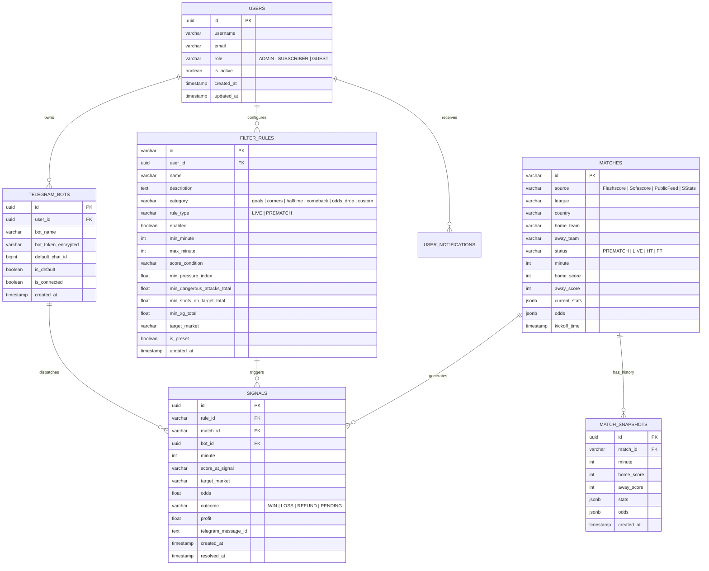

# 🗄️ Схема Базы Данных (Database Schema & ER Diagram)

В данном документе представлена целевая реляционная схема базы данных для промышленного развёртывания (PostgreSQL / Supabase / SQLite).

---

## 1. ER-Диаграмма сущностей (Entity-Relationship Diagram)

---

## 2. Ключевые таблицы и индексы

1. **`filter_rules`**: Индексы по `(user_id, enabled)` и `(min_minute, max_minute)`. Позволяет быстро отбирать активные фильтры при сканировании матча на заданной минуте.
2. **`matches`**: Индекс по `(status, minute)` для мгновенной выборки всех текущих Live-матчей.
3. **`signals`**: Индекс по `(match_id, rule_id)` с ограничением уникальности, предотвращающим повторную отправку дублирующих алертов по одному и тому же фильтру в одном матче.
4. **`telegram_bots`**: Токен бота хранится в зашифрованном виде (`bot_token_encrypted`) и маскируется в API-ответах.
